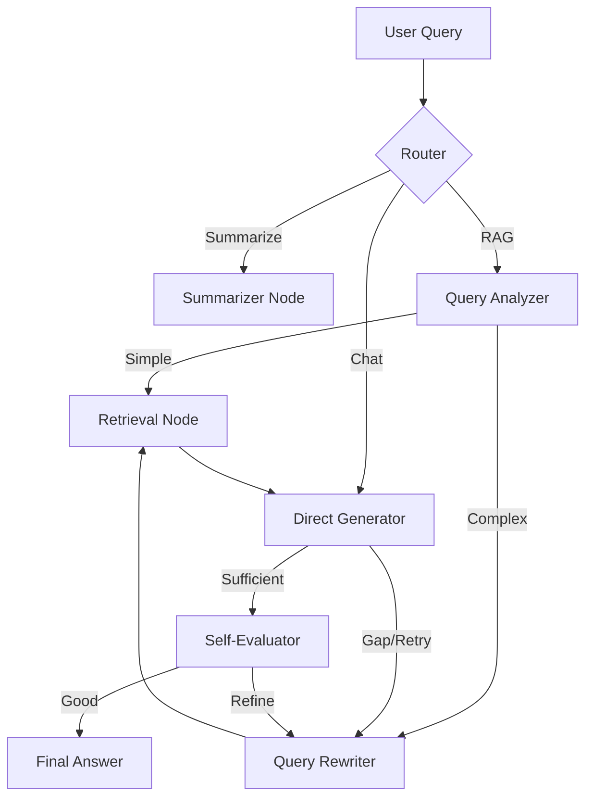

# L88 — Project Architecture & Technology Stack

L88 is a high-performance, local-first agentic RAG (Retrieval-Augmented Generation) system designed for scientific research analysis. It features a sophisticated LangGraph-driven pipeline that combines vector search, keyword search, and multi-step reasoning.

---

## 🏗 System Architecture

The project follows a decoupled client-server architecture:

- **Backend**: Python 3.10+ FastAPI with a LangGraph orchestration layer.
- **Frontend**: React 18+ with a premium, monochrome design system and real-time state management.
- **Storage**: SQLite for relational data and local disk for FAISS indices and document blobs.

---

## 🧠 Agentic RAG Pipeline (The Graph)

The core logic resides in a LangGraph `StateGraph` that manages the decision flow for every user query.

### Key Graph Nodes:
- **Router**: Pure logic node checking for session type and keywords (e.g., "summarize").
- **Query Analyzer**: Classifies queries (Simple, Multi-hop, Math, Comparison) to determine the best retrieval strategy.
- **Query Rewriter**: Iteratively refines queries based on previous failures or "information gaps."
- **Retrieval Node**: The retrieval engine (Hybrid FAISS + BM25).
- **Generator**: Structured JSON generator producing `answer`, `reasoning` (think block), and `sources`.
- **Self-Evaluator**: Threshold-based validator using reranker scores to ensure high confidence.

---

## 🛠 Technology Stack

### 1. Ingestion Engine
- **Parser**: `PyMuPDF` (fitz) for high-accuracy text extraction from scientific PDFs.
- **Chunker**: `pysbd` (Python Sentence Boundary Disambiguation) for sentence-aware splitting, followed by token-based recursive splitting.
- **Metrics**: `tiktoken` (cl100k_base) for precision token counting.

### 2. Neural Models (Local CPU/GPU)
- **Embedder**: `BAAI/bge-base-en-v1.5` — Produces 768-dim vectors for semantic search.
- **Reranker**: `BAAI/bge-reranker-v2-m3` — Cross-encoder used for precise final ranking and confidence scoring.
- **LLM**: `qwen2.5-7b-awq` (via Ollama) — Optimized for structured JSON generation and scientific reasoning.

### 3. Retrieval Stores
- **Vector Store**: `FAISS` (IndexFlatIP) — Optimized for inner-product search (cosine similarity on normalized vectors).
- **Keyword Store**: `Rank-BM25` — Traditional term-frequency search to handle exact matches, scientific notation, and names.
- **Hybrid Blender**: A priority-weighted merging algorithm that balances semantic and keyword results.

### 4. Database & ORM
- **Engine**: `SQLite` — Local, zero-config relational storage.
- **ORM**: `SQLModel` — Combines Pydantic and SQLAlchemy for type-safe database interactions.

---

## 🎨 Frontend Design
- **Framework**: React with Vite.
- **State Management**: React Hooks + API service layer.
- **Styling**: Vanilla CSS with a focus on "high-fidelity achromatic" aesthetics (monochrome, high contrast).
- **Components**: `lucide-react` for iconography, `react-markdown` for answer rendering.

---

## 🔒 Security & Roles
- **Auth**: JWT-based authentication (HS256).
- **RBAC**: Three-tier permission system:
    - **Admin**: Full control over documents, library, and users.
    - **Chat**: Can start sessions and participate in RAG.
    - **Read-Only**: Can view sessions but cannot send messages or modify data.
