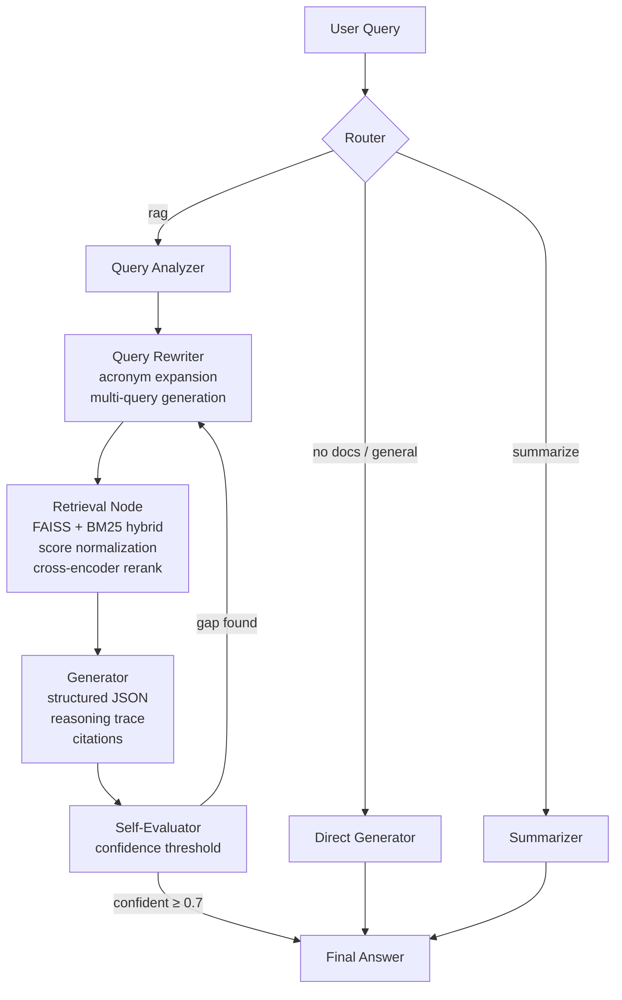

# L88 — Architecture Reference

L88 is a local-first agentic RAG system built for scientific research. This document covers the full technical architecture: ingestion pipeline, retrieval system, graph orchestration, and frontend design.

---

## System Overview

```
┌──────────────────────────────────────────────────────────────────────────────┐
│                          Frontend (React + Vite)                             │
│                                                                              │
│  LoginPage   →   Sidebar (Sessions)   │   ChatPanel           │  RightPanel │
│                  Session CRUD         │   Messages            │  Documents  │
│                  Role Switcher        │   PipelineStatus HUD  │  Scratchpad │
│                                       │   Stop Generation     │  Members    │
├──────────────────────────────────────────────────────────────────────────────┤
│                          Backend (FastAPI + SQLModel)                        │
│                                                                              │
│  /auth  │  /sessions  │  /documents  │  /members  │  /scratchpad  │  /admin │
├──────────────────────────────────────────────────────────────────────────────┤
│                     Intelligence Layer (LangGraph + Ollama)                  │
│                                                                              │
│   Router ──► Analyzer ──► Rewriter ──► Retrieval ──► Generator              │
│                                ▲                          │                  │
│                                └────── Self-Evaluator ◄───┘                  │
├──────────────────────────────────────────────────────────────────────────────┤
│                          Storage                                             │
│                                                                              │
│   SQLite (l88.db)   │   FAISS index (disk)   │   BM25 index (disk)         │
│   Sessions, Users,  │   Per-session vectors  │   Per-session keyword index  │
│   Documents, Msgs   │   + Library index      │                              │
└──────────────────────────────────────────────────────────────────────────────┘
```

---

## 🧠 Agentic RAG Pipeline

The core logic is a LangGraph `StateGraph`. Every user query traverses this graph.



### Graph Nodes

| Node | Description |
|---|---|
| **Router** | Checks session type, doc selection, summarization triggers. Pure logic, no LLM. |
| **Query Analyzer** | Classifies query: `simple`, `multi_hop`, `math`, `comparison`. Determines retrieval strategy. |
| **Query Rewriter** | Expands acronyms (`TRL` → `Technology Readiness Level`), generates 1–3 rewritten sub-queries for broader retrieval coverage. Always includes the original query. |
| **Retrieval** | Embeds queries with BGE prefix, searches FAISS + BM25, normalizes scores to [0,1], blends with adaptive weights, cross-encoder reranks to top-N. |
| **Generator** | Single structured LLM call producing `answer`, `reasoning`, `sources`, `context_verdict`, `missing_info`. |
| **Self-Evaluator** | Checks reranker confidence score. If `< 0.7` and retries remain, sends back to Rewriter with a verdict hint. |

---

## 📄 Ingestion Pipeline

When a PDF is uploaded:

```
PDF file
  └── parser.py (PyMuPDF)
        ├── Extract raw text page-by-page
        ├── Detect cross-page repeating lines → strip headers/footers/page numbers
        └── Return cleaned page texts
              └── chunker.py
                    ├── pysbd sentence segmentation (handles "Fig. 3", "et al.", etc.)
                    ├── RecursiveCharacterTextSplitter (380 tokens, 45 overlap)
                    └── tiktoken cl100k_base token counting
                          └── embedder.py
                                ├── BAAI/bge-base-en-v1.5 (CPU)
                                ├── BGE retrieval prefix applied
                                └── L2-normalized → cosine via FAISS IP
                                      ├── vectorstore.py (FAISS IndexFlatIP)
                                      └── bm25store.py (BM25Okapi)
```

**Parser hardening**: Two-pass approach. Pass 1 extracts all pages. Common lines appearing on ≥2 pages (headers, footers, "Page X of Y", watermarks) are collected. Pass 2 strips those lines and bare page-number patterns before chunking. This prevents boilerplate from polluting chunk relevance scores.

---

## 🔍 Retrieval System

### Hybrid FAISS + BM25

For each rewritten query (up to 3):

1. **FAISS search** — Top-20 by cosine similarity (via `IndexFlatIP` on L2-normalized vectors)
2. **BM25 search** — Top-20 by BM25Okapi score with stopword-filtered tokenizer
3. **Score normalization** — BM25 raw scores (0 → ∞) are min-max normalized to [0,1] so they're commensurable with FAISS cosine scores
4. **Adaptive weight blend**:
   - `simple` queries: 40% FAISS + 60% BM25 (favour exact match)
   - `multi_hop/math/comparison`: 80% FAISS + 20% BM25 (favour semantics)
   - Falls back to 100% of whichever index has results
5. **Deduplication** by `(doc_id, chunk_idx)` across all queries
6. **Document filter** by user-selected doc IDs
7. **Cross-encoder rerank** — `bge-reranker-v2-m3` scores all candidates, returns top-7

### BM25 Tokenizer

Unlike the naive `text.split()`, the improved tokenizer:
- Splits on all punctuation (colons, brackets, quotes, etc.) but preserves hyphens
- Removes ~50 common English stopwords
- Result: `"TRL level"` shares tokens with `"Technology Readiness Level (TRL)"` correctly

### Models

| Model | Task | Device | Dim |
|---|---|---|---|
| `BAAI/bge-base-en-v1.5` | Embedding | CPU | 768 |
| `BAAI/bge-reranker-v2-m3` | Cross-encoder reranking | CPU | — |
| `qwen2.5-7b-awq` | Text generation | GPU | — |

---

## 🔤 Query Rewriting & Acronym Expansion

Before the LLM call, `_pre_expand_acronyms()` detects ALL-CAPS tokens (e.g. `TRL`, `SLA`) and appends them as expansion hints to the prompt. The LLM is then explicitly instructed via system prompt to:

1. Expand all abbreviations and acronyms
2. Include both the short form and full form in every query
3. For "what is X" queries, also generate `"X definition"` and `"X explained"` variants

The original raw query is always included in the final candidate set (belt + suspenders for exact-term matching).

---

## 🗃 Database Schema

| Table | Key Fields |
|---|---|
| `user` | `id`, `username`, `password_hash`, `role`, `active` |
| `session` | `id`, `name`, `owner_id`, `type` (general/rag), `web_mode` |
| `sessionmember` | `session_id`, `user_id`, `role` |
| `document` | `id`, `session_id`, `filename`, `source`, `page_count`, `chunk_count`, `selected` |
| `message` | `id`, `session_id`, `user_id`, `role`, `content`, `reasoning`, `confident`, `context_verdict`, `missing_info`, `retrieval_debug`, `created_at` |
| `scratchpad` | `session_id`, `content` |

---

## ⚡ Async Document Deletion

Deleting a document requires rebuilding the FAISS + BM25 index without the deleted doc's chunks. This is slow (re-embeds all remaining docs). The router now:

1. Removes the DB record and PDF file **synchronously**
2. Returns `200 {"detail": "Document deleted"}` immediately
3. Runs `_rebuild_session_index()` via FastAPI `BackgroundTasks`

This prevents HTTP timeouts on large document sets.

---

## 🎨 Frontend

| Component | Responsibility |
|---|---|
| `App.tsx` | Root layout, session state, AbortController for stop generation, deletingDocs tracking |
| `Sidebar.tsx` | Session list, create/delete session, role switcher |
| `ChatPanel.tsx` | Message list, input, stop button, `PipelineStatus` ambient HUD |
| `RightPanel.tsx` | Document list (with async delete spinner), scratchpad, member management |
| `LoginPage.tsx` | JWT auth form |
| `api.ts` | HTTP client with AbortSignal support for cancelling in-flight requests |

### PipelineStatus HUD

While the backend is processing, the loading dots are replaced by a cycling monospaced status line:

```
analyzing query...
rewriting queries..
searching vector store.
reranking evidence...
generating answer..
```

Each step fades in/out with a subtle slide animation via Framer Motion.

### Stop Generation

An `AbortController` is created per request in `handleSend`. When the stop button is clicked, `controller.abort()` cancels the fetch. The backend receives the disconnection and stops streaming.

---

## 🔒 Security & Roles

- **Auth**: JWT (HS256), 8-hour expiry
- **RBAC**: Global role per user (`admin` / `chat` / `read_only`) + optional per-session override via `SessionMember`
- **Role resolution**: Session membership role takes precedence over global role for that session

| Capability | Admin | Chat | Read Only |
|---|:---:|:---:|:---:|
| Send messages | ✅ | ✅ | ❌ |
| Upload / delete documents | ✅ | ❌ | ❌ |
| Toggle document selection | ✅ | ✅ | ❌ |
| Manage members | ✅ | ❌ | ❌ |
| Edit scratchpad | ✅ | ❌ | ❌ |
| View everything | ✅ | ✅ | ✅ |

---

## ⚙️ Configuration (`config.py`)

| Parameter | Default | Description |
|---|---|---|
| `CHUNK_SIZE` | 380 | Tokens per chunk |
| `CHUNK_OVERLAP` | 45 | Token overlap |
| `RETRIEVE_TOP_K` | 20 | Candidates per query (FAISS + BM25 each) |
| `RERANK_TOP_N` | 7 | Final chunks after reranking |
| `MAX_ALT_QUERIES` | 3 | Rewritten queries per attempt |
| `MAX_REWRITES` | 2 | Max retry loops |
| `LLM_NUM_CTX` | 16384 | Context window (overrides Ollama default of 4096) |
| `LLM_TEMPERATURE` | 0 | Deterministic generation |
| `EMBED_MODEL` | `bge-base-en-v1.5` | Embedding model |
| `RERANKER_MODEL` | `bge-reranker-v2-m3` | Reranker model |
| `LLM_MODEL` | `qwen2.5-7b-awq` | Primary LLM (GPU) |
| `LLM_MODEL_FALLBACK` | `qwen2.5:14b` | CPU fallback |
