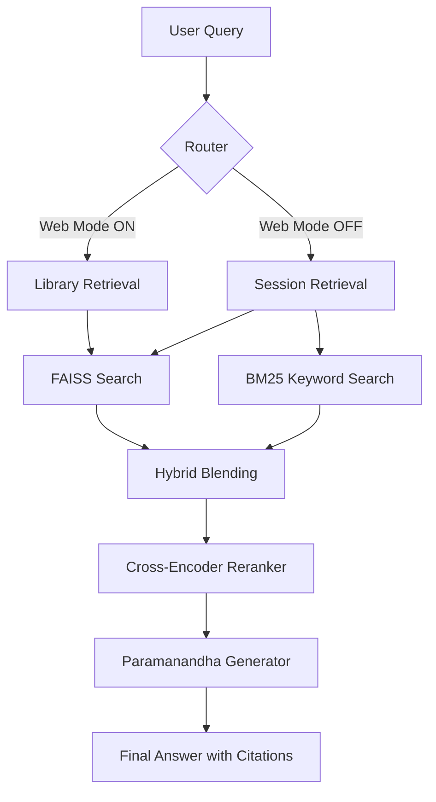

# L88 Federated RAG Architecture

The L88 system implements an **Agentic RAG Pipeline** designed for high-fidelity scientific research. It uses **LangGraph** to orchestrate specialized nodes that move beyond simple search-and-retrieve patterns.

---

## 🏗️ System Overview

---

## 🛠️ Core Components

### 1. Hybrid Indexting & Retrieval
*   **Semantic Search (FAISS)**: Uses `BAAI/bge-base-en-v1.5` embeddings to find chunks that match the *meaning* of the query.
*   **Keyword Search (BM25)**: Ensures exact terminology (like chemical formulas or physics constants) is captured.
*   **Adaptive Blending**: Scores from both indexes are blended. If one index is empty, the system automatically shifts 100% weight to the active index.

### 2. The Agentic Refinement Loop
*   **Query Rewrite**: The system generates up to 3 variations of your question to ensure multi-angle coverage of the document store.
*   **Reranking (The Gold Standard)**: We use a **Cross-Encoder** (`bge-reranker-v2-m3`). Unlike standard retrievers, the reranker looks at the Query and the Chunk *together* to assign a high-precision relevancy score. We discard anything below a fixed threshold.

### 3. Paramanandha Generation Node
The LLM (Qwen 2.5) operates in two distinct modes:
*   **Strict Grounding (RAG/Web)**: The model is prohibited from using training data. If the answer isn't in the provided chunks, it must state: *"The provided documentation does not contain the answer."*
*   **General knowledge (Chat)**: Used only when no documents are selected, allowing for general scientific assistance.

### 4. Data Scope & Badging
*   **Session Store**: Temporary, private storage for PDFs uploaded to a specific chat. Citations show a **DOC** 📄 badge.
*   **Library Store (Web Mode)**: A permanent, global repository of knowledge. Citations show a **WEB** 🌐 badge.

---

## 🚀 Key Features
*   **LaTeX Support**: Specialized handling for scientific equations using `katex`.
*   **Metadata Persistence**: Citation sources (filename, page, origin) are saved in the SQLite database (`l88.db`) to ensure badge consistency across refreshes.
*   **Asynchronous Processing**: File ingestion and RAG querying run in parallel where possible to minimize latency.
